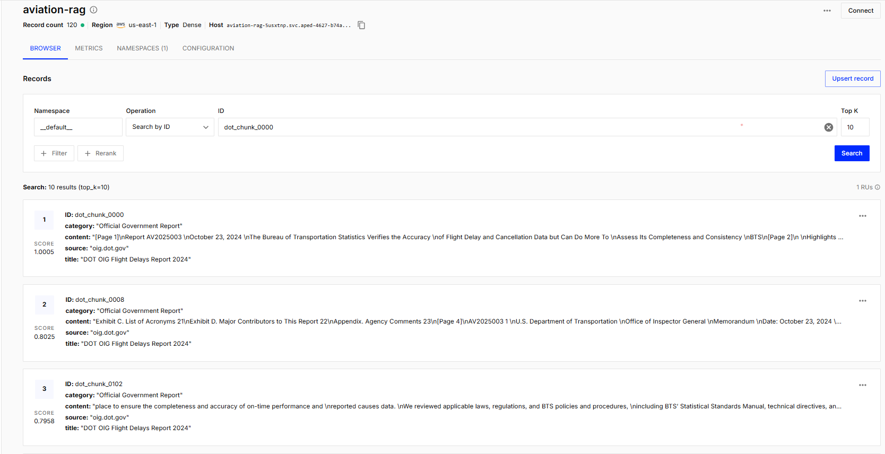

 # ✈️ Aviation RAG Assistant

Production RAG pipeline over the official **DOT OIG Flight Delays & Cancellations Report (Oct 2024)**.  
Combines fine-tuned Llama-3.2-3B-Instruct with Pinecone vector search to answer aviation operations questions with grounded, source-cited responses.

[](https://huggingface.co/Mervecaliskan/llama3.2-3b-dolly-qlora)
[](https://pinecone.io)
[](https://python.org)

---

## Architecture

```
DOT OIG PDF (28 pages, 53,970 chars)
   ↓  PyPDF → extract text
   ↓  RecursiveCharacterTextSplitter (chunk_size=500, overlap=50)
   ↓  120 chunks @ 454 chars avg
   ↓  all-MiniLM-L6-v2 → 384-dim embeddings
   ↓  Pinecone upsert (AWS us-east-1, cosine similarity)

User question
   ↓  embed → Pinecone top-3 retrieval
   ↓  Fine-tuned Llama-3.2-3B + context
   ↓  Grounded answer with source citation
```

---

## Document

| Field | Value |
|-------|-------|
| Source | DOT Office of Inspector General |
| Title | *The Bureau of Transportation Statistics Verifies the Accuracy of Flight Delay and Cancellation Data but Can Do More To Assess Its Completeness and Consistency* |
| Date | October 23, 2024 |
| Pages | 28 |
| URL | [oig.dot.gov](https://www.oig.dot.gov/library-item/flight-delays-and-cancellations) |

---

## Key Parameters

| Parameter | Value | Why |
|-----------|-------|-----|
| chunk_size | 500 chars | Fits model context, enough semantic content |
| chunk_overlap | 50 chars | Prevents information loss at boundaries |
| Total chunks | 120 | 28-page report → 454 avg chars/chunk |
| Embedding model | all-MiniLM-L6-v2 | Fast, 384-dim, free |
| Embedding dimension | 384 | Pinecone index dimension |
| Similarity metric | Cosine | Standard for semantic search |
| top_k retrieval | 3 | Balance: context length vs coverage |
| LLM temperature | 0.3 | Low = factual, consistent answers |

---

## Pinecone Index

```
Index name : aviation-rag
Cloud      : AWS us-east-1
Type       : Dense
Dimension  : 384
Metric     : Cosine
Vectors    : 120
Capacity   : On-demand (Starter tier)
```

---

## RAG vs No-RAG — Key Result

**Q:** What does the DOT report say about airline on-time performance improvements?

| | Answer |
|--|--------|
| ❌ Without RAG | "77.4% of flights were on-time in 2022" — hallucinated, no source |
| ✅ With RAG | "Improved consistency in BTS data would allow evaluation of carriers' performance" — from DOT report |

RAG eliminates hallucination by grounding responses in the actual document.

---

## Retrieval Quality

Sample retrieval scores (cosine similarity, 0–1):

| Query | Top chunk score | Assessment |
|-------|----------------|------------|
| What causes flight delays? | 0.755 | ✅ Strong |
| Weather and cancellations? | 0.521 | ✅ Moderate |
| On-time performance rate? | 0.559 | ✅ Moderate |

Scores reflect document coverage — the report focuses more on data quality than weather specifics.

---

## Sample Outputs

**Q: What are the main causes of flight delays?**
> The main causes of flight delays are categorized into five broad categories:
> 1. Air carrier, 2. Extreme weather, 3. NAS, 4. Late-arriving aircraft, 5. Security

**Q: What recommendations does the report make?**
> The report recommends updating BTS's standard operating procedures for collecting,
> processing, and disseminating airline on-time performance data.

**Q: Which airlines have the worst delay rates?**
> American Airlines (44.8%), Delta Air Lines (43.9%), United Airlines (43.4%)

---

## Project Structure

```
aviation-rag-assistant/
├── Aviation_RAG_Assistant_v2.ipynb   # Full pipeline notebook
├── dot_flight_delays_2024.pdf        # Source document (DOT OIG)
├── requirements.txt
└── README.md
```

## Quick Start

```bash
# 1. Colab'da aç (T4 GPU önerilir)
# 2. Secrets'a ekle:
#    PINECONE_API_KEY → pinecone.io
#    HF_TOKEN        → huggingface.co/settings/tokens
# 3. Runtime → Run all
```

## Requirements

```
pinecone>=3.0.0
sentence-transformers
pypdf
langchain-text-splitters
transformers>=4.43.0
peft
accelerate
bitsandbytes
unsloth
torch
```

---

## Related Project

Fine-tuning pipeline: [llama3-qlora-finetuning](https://github.com/Mervecaliskann/llama3-qlora-finetuning)  
The Llama-3.2-3B model used here was fine-tuned with QLoRA on Dolly-15K.
Model: [Mervecaliskan/llama3.2-3b-dolly-qlora](https://huggingface.co/Mervecaliskan/llama3.2-3b-dolly-qlora)

---

## Pinecone Index — Live


*Portfolio project — AI Engineering · Merve Caliskan · 2026*
